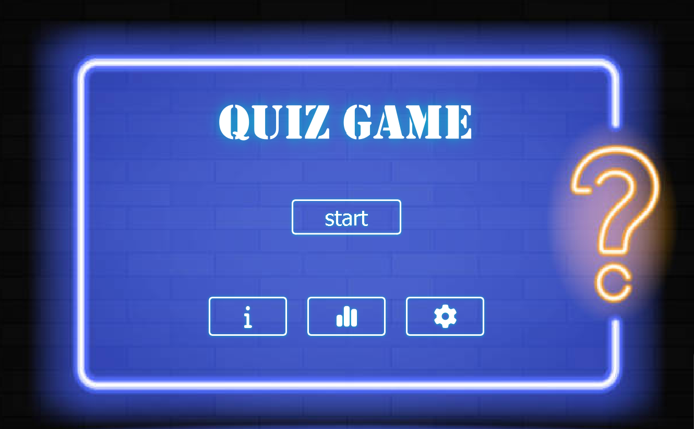

# 🚀 QuizGame: Test Your Knowledge!

Your Qt Quiz Game is a fun and interactive trivia app where players test their knowledge across various domains, earning points for correct answers.

Challenge your friends and family with a wide variety of questions!


## 📋 Table of Contents

- [About](#about)
- [Features](#features)
- [Demo](#demo)
- [Quick Start](#quick-start)
- [Installation](#installation)
- [Usage](#usage)
- [Configuration](#configuration)
- [Project Structure](#project-structure)
- [Contributing](#contributing)
- [Testing](#testing)
- [Deployment](#deployment)
- [FAQ](#faq)
- [License](#license)
- [Support](#support)
- [Acknowledgments](#acknowledgments)

## About

QuizGame is a Qt-based application designed to provide an engaging and educational trivia experience. It allows users to test their knowledge across various categories, earn points, and compete with others. The application is built with a focus on a clean user interface and smooth, responsive gameplay.

This project aims to provide a fun and accessible way for users to learn and challenge themselves. It targets trivia enthusiasts, students, and anyone looking for an entertaining way to expand their knowledge.

The core technologies used are C++ and the Qt framework, enabling cross-platform compatibility and a native look and feel. The architecture is designed for modularity, allowing for easy addition of new question categories and features. The unique selling point is its ease of use and customizable question sets.

## ✨ Features

- 🎯 **Diverse Question Categories**: Wide range of trivia topics to choose from.
- ⚡ **Smooth Gameplay**: Optimized for responsive and engaging user experience.
- 🎨 **Sleek UI**: Modern and intuitive Qt-based user interface.
- 🏆 **Score Tracking**: Keep track of your progress and compete with friends.
- 🛠️ **Extensible**: Easily add new question sets and categories.

## 🎬 Demo

🔗 **Live Demo**: [Coming soon ...]

### Screenshots

*Main application interface *

## 🚀 Quick Start

Clone and run in 3 steps:

```bash
git clone https://github.com/ayoubelhilali/QuizGame.git
cd QuizGame
# Open the .pro file in Qt Creator and build/run the project
```

## 📦 Installation

### Prerequisites
- Qt 5.15+
- C++ Compiler (GCC, Clang, MSVC)
- Git

### Option 1: From Source
```bash
# Clone repository
git clone https://github.com/ayoubelhilali/QuizGame.git
cd QuizGame

# Open the QuizGame.pro file in Qt Creator
# Build the project
# Run the executable
```

## 💻 Usage

### Basic Usage
1.  Launch the QuizGame executable.
2.  Select a category from the main menu.
3.  Answer the questions and earn points.
4.  View your score at the end of the quiz.

### Advanced Examples
You can modify the question sets by editing the data files in the `data/` directory.

## ⚙️ Configuration

### Configuration File
The application settings can be configured in the `config.json` file:

```json
{
  "app_name": "QuizGame",
  "version": "1.0.0",
  "settings": {
    "difficulty": "medium",
    "timer": 30,
    "theme": "light"
  }
}
```

## 📁 Project Structure

```
QuizGame/
├── 📁 src/
│   ├── 📁 ui/                  # Qt UI files (.ui)
│   ├── 📁 core/                # Core game logic
│   ├── 📁 data/                # Question data files
│   ├── 📄 main.cpp             # Application entry point
│   └── 📄 QuizGame.pro         # Qt project file
├── 📁 include/               # Header files
├── 📁 resources/             # Images and other resources
├── 📄 README.md              # Project documentation
└── 📄 LICENSE                # License file
```

## 🤝 Contributing

We welcome contributions! Please see our [Contributing Guide](CONTRIBUTING.md) for details.

### Quick Contribution Steps
1. 🍴 Fork the repository
2. 🌟 Create your feature branch (git checkout -b feature/AmazingFeature)
3. ✅ Commit your changes (git commit -m 'Add some AmazingFeature')
4. 📤 Push to the branch (git push origin feature/AmazingFeature)
5. 🔃 Open a Pull Request

### Development Setup
```bash
# Fork and clone the repo
git clone https://github.com/yourusername/QuizGame.git

# Open QuizGame.pro in Qt Creator
# Configure build settings
# Build and run the project
```

### Code Style
- Follow existing code conventions
- Use consistent naming
- Add comments where necessary
- Test thoroughly

## Testing

To run tests:

1.  Open the project in Qt Creator.
2.  Create a test project.
3.  Write test cases using Qt Test.
4.  Run the tests.

## Deployment

### Desktop Deployment
1.  Build the project in Release mode.
2.  Package the executable with necessary Qt libraries.
3.  Create an installer for the target platform.


## 📄 License

This project is licensed under the MIT License - see the [LICENSE](LICENSE) file for details.

### License Summary
- ✅ Commercial use
- ✅ Modification
- ✅ Distribution
- ✅ Private use
- ❌ Liability
- ❌ Warranty

## 💬 Support

- 📧 **Email**: elhilaliayoub2020@gmail.com

## 🙏 Acknowledgments

- 🎨 **UI Design**: Qt Framework
- 📚 **Libraries used**:
  - Qt Core - Core functionalities
  - Qt Widgets - UI components
